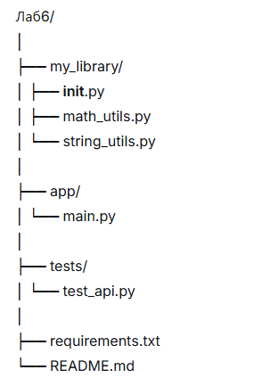
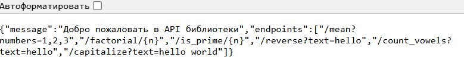
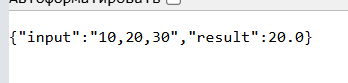
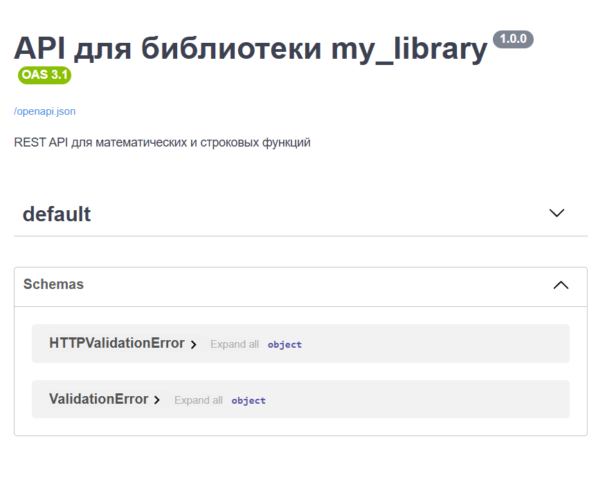
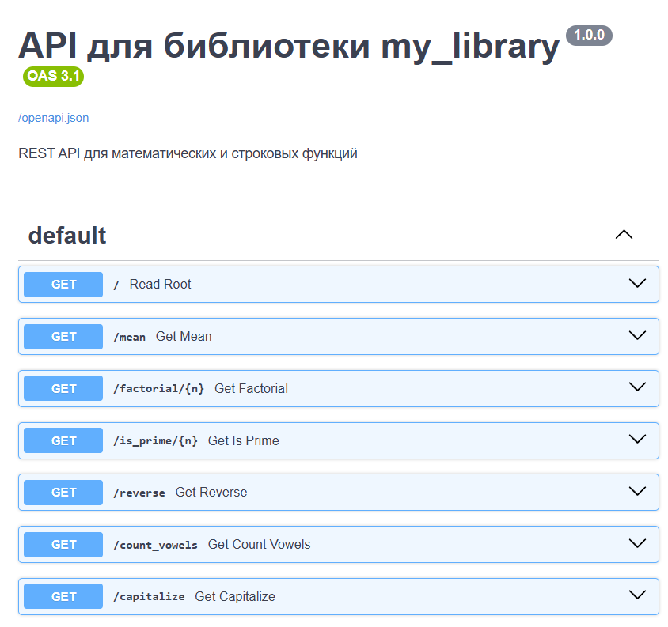
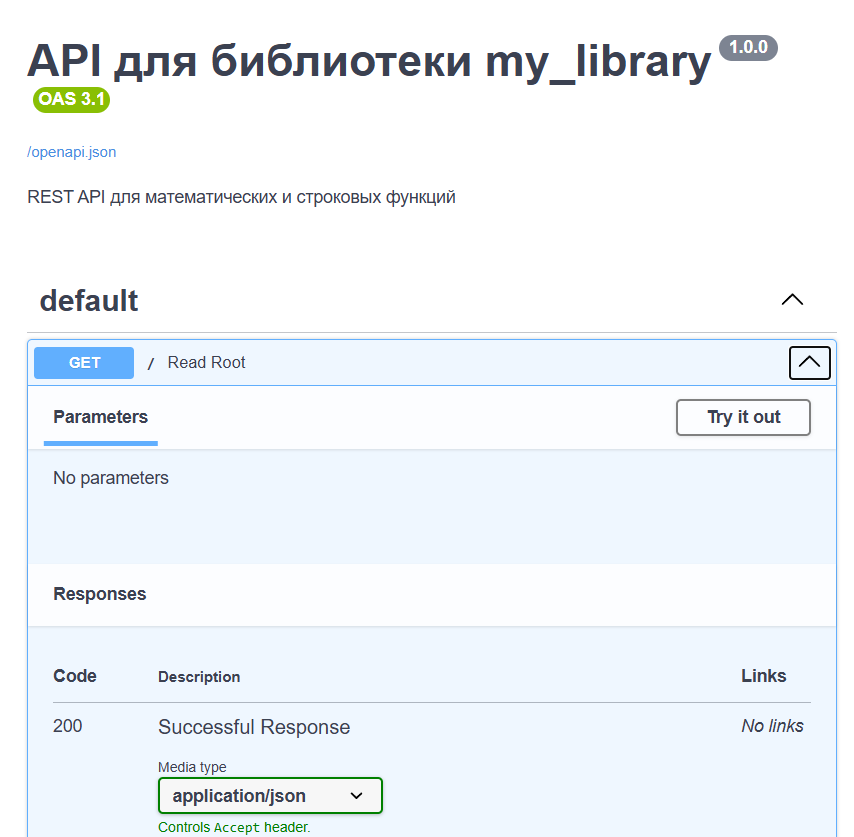

# Отчёт по лабораторной работе №6

**Дисциплина:** Разработка инструментального программного обеспечения  
**Тема:** Создание REST API для библиотеки с использованием FastAPI  
**Выполнила:** Екатерина Сабынина  
**Группа:** 222  

---

## 1. Цель работы

Получить практические навыки создания веб-интерфейса (REST API) для ранее разработанной библиотеки, чтобы обеспечить доступ к её функциям через HTTP-запросы.

---

## 2. Задачи работы

- Использовать библиотеку, созданную в лабораторной работе №3
- Спроектировать API для доступа к функциям библиотеки
- Реализовать веб-сервис на FastAPI
- Проверить работу API через браузер и встроенную документацию Swagger
- Подготовить отчёт о проделанной работе

---

## 3. Выполненные операции

### 3.1 Выбор технологии

Для реализации веб-сервиса выбран **FastAPI**. Этот современный фреймворк для Python отличается высокой производительностью, простотой написания кода и автоматической генерацией документации (Swagger UI).

### 3.2 Структура проекта



### 3.3 Используемая библиотека

В работе использована библиотека из лабораторной работы №3, содержащая шесть функций.

**Математический модуль:** `calculate_mean` (среднее арифметическое), `factorial` (факториал), `is_prime` (проверка на простоту)

**Строковый модуль:** `reverse_string` (обратный порядок символов), `count_vowels` (подсчёт гласных), `capitalize_words` (заглавные буквы в словах)

### 3.4 Созданные эндпоинты API

В рамках работы реализовано 7 эндпоинтов.

| Эндпоинт | Метод | Что делает |
|----------|-------|-------------|
| `/` | GET | Приветственное сообщение и список всех доступных эндпоинтов |
| `/mean` | GET | Принимает список чисел, возвращает среднее значение |
| `/factorial/{n}` | GET | Вычисляет факториал переданного числа |
| `/is_prime/{n}` | GET | Проверяет, является ли число простым |
| `/reverse` | GET | Переворачивает переданную строку |
| `/count_vowels` | GET | Подсчитывает количество гласных букв в строке |
| `/capitalize` | GET | Преобразует первую букву каждого слова в заглавную |

### 3.5 Запуск сервера

Сервер запускался следующей командой:

```bash
py -m uvicorn app.main:app --reload

После запуска сервер доступен по адресу http://127.0.0.1:8000
```


### 3.6 Проверка работы API

**Тестирование через браузер**

Пример обращения к эндпоинту `/mean` с параметрами:  
`http://127.0.0.1:8000/mean?numbers=10,20,30`

Ответ сервера:

```json
{
  "input": "10,20,30",
  "result": 20.0
}
```

### Swagger UI — автоматическая документация

FastAPI автоматически сгенерировал документацию по адресу http://127.0.0.1:8000/docs. На этой странице можно ознакомиться со всеми эндпоинтами, их параметрами и выполнить тестовые запросы.





### Автоматические тесты API

Для проверки работоспособности API написаны тесты с использованием pytest. Запуск:

```bash
py -m pytest tests/test_api.py -v
```

## 4. Примеры работы API
Запрос	Ответ
/factorial/5	{"input": 5, "result": 120}
/is_prime/17	{"input": 17, "result": true}
/reverse?text=hello	{"input": "hello", "result": "olleh"}
/count_vowels?text=hello	{"input": "hello", "result": 2}
/capitalize?text=hello world	{"input": "hello world", "result": "Hello World"}
## 5. Выводы
Преимущества создания API поверх библиотеки:

Функции библиотеки становятся доступны из любого языка программирования через HTTP

Библиотека превращается в независимый микросервис для удалённого использования

API легко подключать к веб- и мобильным приложениям

Важность правильного проектирования API:

Качественная документация ускоряет интеграцию для других разработчиков

Единообразие эндпоинтов снижает количество ошибок при использовании

Понятные сообщения об ошибках повышают надёжность сервиса

Возможные направления улучшения:

Добавить POST-запросы для передачи сложных данных

Внедрить аутентификацию (API-ключи или JWT-токены)

Добавить ограничение частоты запросов (rate limiting)

Контейнеризировать приложение с помощью Docker

Расширить документацию примерами на разных языках

https://image-4.png